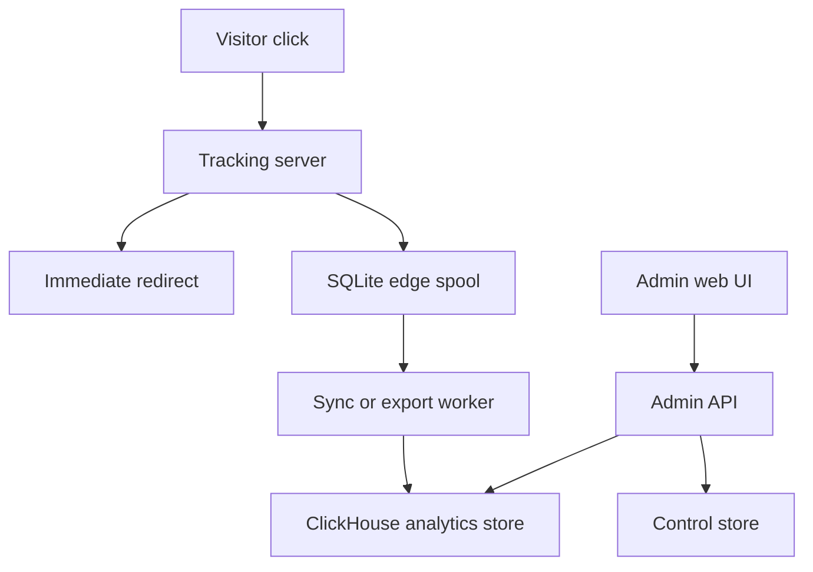

# Ad Buy Engine Revival - Plan

## Goal Capsule

| Field | Value |
|---|---|
| Objective | Reframe Ad Buy Engine as a modern self-hosted advertising tracker, campaign manager, and analytics tool that can run cheaply for small users while scaling into ClickHouse-backed reporting for high-volume users. |
| Product authority | John wants a tool he can personally use for advertising, keep private data out of the public repo, and make the public project useful for other self-hosting users. |
| Execution profile | Code, infrastructure, UI, database, and documentation work will be needed, but this artifact captures requirements and architectural product direction only. |
| Open blockers | The default UI stack, first supported deployment profile, sync direction, and v1 authentication model need confirmation before implementation planning. |

---

## Product Contract

### Summary

Ad Buy Engine should become a free, self-hosted performance marketing tracker with a web-first operations UI, a fast click tracking server, and flexible storage profiles.
The default path should favor cheap deployment and easy local testing, while the high-volume path should use ClickHouse for analytics and future machine learning work.
The current Yew/Actix prototype should be preserved as legacy reference, not treated as the foundation for production behavior.

### Problem Frame

The existing project already contains useful product vocabulary: campaigns, offers, landers, funnels, traffic sources, conversions, browsers, devices, operating systems, day parting, and reporting tables.
It also shows a working secure Yew/WASM UI shell, but the current codebase is a legacy prototype with old dependencies, commented-out click routing, incomplete graphing, and a stubbed click processing path.

The target product needs to compete with the operational shape of CPV Lab, RedTrack, and Voluum: dense reporting, campaign setup, visitor and conversion tracking, cost and revenue views, split testing, bot or blocked traffic visibility, traffic source integrations, and fast reporting.
The difference is positioning: Ad Buy Engine should be self-hosted, free, practical for one operator, and flexible enough to run on a small VPS or on a local workstation with serious analytics hardware.

### Key Decisions

- **Web-first admin UI.** The default interface should be a browser app built with semantic, testable web UI technology, not a Flutter-first app and not a continuation of the current Yew prototype.
- **WASM as a capability, not the whole UI bet.** WebAssembly should be available for heavy local analytics, shared Rust logic, or future ML helpers, but the v1 UI should remain easy to inspect, test, and automate through browser tooling.
- **Separate the tracking path from the reporting path.** The click server should prioritize accepting the visit and redirecting quickly; reporting can happen through a later ingestion and analytics layer.
- **Use ClickHouse as the high-volume analytics store.** ClickHouse fits append-heavy click and conversion events, fast grouped reports, and future feature engineering better than PostgreSQL, MySQL, or SQLite.
- **Use SQLite as the minimal edge buffer.** A cheap VPS should be able to capture clicks into a local durable spool even when ClickHouse is remote, offline, or intentionally not installed.
- **Keep control data separate from event data.** Campaign definitions, users, offers, landers, traffic sources, and settings have different needs than raw click events and should not be forced into the same storage model.
- **Treat legacy code as a preserved relic.** The current Yew UI, old server, and old migrations should be retained for reference during the transition, but production planning should assume a new architecture.

### UI Direction

| Option | Fit | Pros | Cons | Recommendation |
|---|---|---|---|---|
| Continue current Yew UI | Low | Reuses existing Rust/WASM concept and some product vocabulary. | Current repo uses old Yew patterns and a git master dependency; continuing it keeps the project tied to legacy state. | Do not continue as the main path. Preserve as reference. |
| New Yew, Leptos, or Dioxus UI | Medium | Keeps UI in Rust and can share types with backend logic. Dioxus also has a native app story. | Smaller ecosystem than mainstream web UI, more risk for dashboards, and still less direct than plain DOM for testing. | Consider later only if Rust UI is a core product goal. |
| Flutter UI | Medium | Strong cross-platform story for mobile, desktop, and web; good if native apps become central. | Browser DOM inspection and ordinary web automation are weaker; web dashboard workflows can feel less native to the web. | Defer for native companion apps, not v1 admin UI. |
| Semantic web UI with TypeScript | High | Easy browser testing, accessible DOM, large dashboard ecosystem, direct self-hosted web deployment, and optional Tauri shell later. | Adds TypeScript to a Rust-centered project. | Recommended v1 admin UI direction. |

Yew is not abandoned based on live GitHub activity checked during this brainstorm: `yewstack/yew` had a 2026 release and recent repository activity.
That does not make it the best v1 choice for this project because the current codebase is far behind modern Yew and the product needs a dense, easily-tested operations UI.

### Storage And Deployment Profiles

| Profile | Target user | Runtime shape | Storage shape | Notes |
|---|---|---|---|---|
| Local demo | Developer or evaluator | Run everything locally with one command. | SQLite for control and event spool, optional seeded demo data. | Required for fast development and public contributors. |
| Minimal tracker VPS | User with a cheap VPS | Lightweight click server receives visits and redirects. | Local SQLite spool, with scheduled/manual offload. | Fits the $5 VPS idea and keeps ClickHouse off tiny hardware. |
| Hybrid local analytics | John or a power user | Cheap VPS captures events; powerful local machine stores and analyzes them. | Edge SQLite spool syncs into local ClickHouse. | Best fit for John's powerful workstation use case. |
| Single larger VPS | User who wants one cloud box | Tracker, admin API, and analytics run on one larger server. | ClickHouse plus a control store on the same VPS. | Useful for a $20-$30 VPS or dedicated analytics node. |
| External analytics | Advanced user | Tracker connects to a user-managed analytics endpoint. | Remote ClickHouse or compatible export target. | Keeps the product flexible without hosting the user's database. |



### Proposed Repository Shape

The future public repository should be reorganized around clear duties.
This is a planning target, not a request to move files immediately.

```text
config/
  examples/
  profiles/
core/
  domain/
  events/
  reporting/
runtime/
  tracker/
  admin_api/
  admin_web/
  sync_worker/
infra/
  scripts/
  docker/
  linode/
tests/
  integration/
  browser/
  load/
docs/
  plans/
  guides/
  legacy/
legacy/
  yew_prototype/
```

Scripts should live under `infra/scripts/`.
The first developer experience should include a local serve script, a local seeded demo script, a minimal Linode tracker script, and a separate ClickHouse node script.

### Actors

- A1. Operator: John or another self-hosting media buyer who creates campaigns and reviews performance.
- A2. Contributor: a developer who clones the public repo and wants a fast local build and demo path.
- A3. Visitor: an anonymous person whose click, redirect path, device, source, and conversion may be tracked.
- A4. Tracking Server: the public-facing low-latency service that receives clicks and redirects visitors.
- A5. Analytics Store: ClickHouse or a smaller local store used for reports and future feature engineering.
- A6. Admin UI: the browser interface used to configure campaigns, inspect reports, and manage deployment settings.

### Requirements

**Product Positioning**

- R1. Ad Buy Engine must be usable as a self-hosted advertising tracker for campaign setup, click tracking, conversion tracking, and reporting.
- R2. The public product must remain useful without private data, private ad accounts, or John's local infrastructure.
- R3. The product should preserve the existing domain vocabulary where it still matches modern tracker expectations.
- R4. The v1 product should prioritize one-operator usability over enterprise team features.

**Admin UI**

- R5. The default admin UI must be web-first, data-dense, browser-testable, and navigable without relying on a native shell.
- R6. The UI must include the operational surfaces expected from modern trackers: campaigns, traffic sources, offers, landers, funnels, conversions, reports, settings, and deployment health.
- R7. The UI must support dense reporting tables with search, filters, date ranges, column selection, exports, and saved report views.
- R8. The UI must allow a future native shell without requiring the product to become Flutter-first.

**Tracking And Data**

- R9. The tracking server must accept a click event, record enough information for later analytics, and redirect the visitor quickly.
- R10. The minimal deployment must survive temporary analytics outages by writing click events to a durable local spool.
- R11. ClickHouse must be the preferred analytics store for high-volume event data and future ML-friendly feature extraction.
- R12. SQLite must be supported for local development, demo mode, and minimal edge capture.
- R13. PostgreSQL may remain useful for control data, but it should not be the default high-volume click analytics store.
- R14. MySQL support should be deferred unless a real user need appears, because it expands the support matrix without improving the main analytics story.

**Sync And Offload**

- R15. A minimal tracker VPS must be able to offload captured events into local or remote ClickHouse by scheduled sync or manual command.
- R16. Sync must be resumable, idempotent, and observable enough that the operator can tell whether the edge spool is falling behind.
- R17. The system must keep raw events immutable enough for future reporting changes and ML feature engineering.

**Deployment And Local Development**

- R18. The repo must provide a one-command local demo path that starts the admin UI, API, tracker, and a small storage profile.
- R19. The repo must provide a minimal Linode tracker setup script for users who want the cheapest practical VPS deployment.
- R20. The repo must provide a separate ClickHouse setup path for local machines or larger VPS nodes.
- R21. Configuration examples must be public-safe, while real secrets and private operating files remain outside the public repo.

**Legacy Transition**

- R22. The current Yew frontend and legacy Actix server should be documented as historical prototype code before being replaced or moved.
- R23. Any feature that survives from the legacy UI should be reintroduced through the new architecture rather than copied blindly.
- R24. The project should keep enough legacy screenshots or notes to preserve product memory without making old code look production-supported.

### Key Flows

- F1. Local evaluation
  - **Trigger:** A contributor clones the public repo.
  - **Actors:** A2, A6.
  - **Steps:** The contributor runs the local demo script, gets seeded demo data, opens the admin UI, creates a campaign, and sees a report update.
  - **Outcome:** The project is understandable without private credentials or a live ad account.
  - **Covered by:** R2, R5, R18, R21.

- F2. Minimal VPS click capture
  - **Trigger:** An operator deploys the tracker to a cheap VPS.
  - **Actors:** A1, A3, A4.
  - **Steps:** A visitor hits a campaign link, the tracker records the event into its local spool, and the visitor is redirected.
  - **Outcome:** The click path works without ClickHouse installed on the VPS.
  - **Covered by:** R9, R10, R12, R19.

- F3. Hybrid offload to ClickHouse
  - **Trigger:** The operator wants high-volume analytics on a more powerful local or remote machine.
  - **Actors:** A1, A4, A5.
  - **Steps:** The sync worker transfers unsent edge events into ClickHouse, marks safe progress, and exposes lag or failure state.
  - **Outcome:** A small tracker can feed a large analytics database without losing control of cost.
  - **Covered by:** R11, R15, R16, R17.

- F4. Reporting and optimization
  - **Trigger:** The operator reviews campaign performance.
  - **Actors:** A1, A5, A6.
  - **Steps:** The UI loads date-filtered metrics, breaks results down by campaign dimensions, exports data, and keeps saved report views.
  - **Outcome:** The operator can decide what to scale, pause, or investigate.
  - **Covered by:** R6, R7, R11, R17.

- F5. Legacy retirement
  - **Trigger:** A modern replacement exists for a legacy capability.
  - **Actors:** A1, A2.
  - **Steps:** The old behavior is documented, the replacement is built in the new architecture, and the legacy code is marked or moved as archived.
  - **Outcome:** The project preserves history without carrying production ambiguity.
  - **Covered by:** R22, R23, R24.

### Acceptance Examples

- AE1. Local demo works without secrets
  - **Covers R2, R18, R21.**
  - **Given:** A new contributor has cloned the public repo.
  - **When:** They run the local demo command.
  - **Then:** They can open the admin UI and inspect seeded campaigns without a private `.env`.

- AE2. Minimal tracker survives analytics outage
  - **Covers R9, R10, R15, R16.**
  - **Given:** The tracker VPS cannot reach ClickHouse.
  - **When:** Visitors click campaign links.
  - **Then:** The tracker redirects visitors and queues events locally for later sync.

- AE3. ClickHouse profile enables fast grouped reports
  - **Covers R7, R11, R17.**
  - **Given:** Events have been synced into ClickHouse.
  - **When:** The operator opens a campaign report by date range and dimension.
  - **Then:** The UI can render grouped metrics without scanning the edge spool directly.

- AE4. SQLite-only mode remains honest
  - **Covers R10, R12, R13.**
  - **Given:** A user runs only the minimal SQLite profile.
  - **When:** They open reporting.
  - **Then:** The product works for demo and small use, while clearly labeling any high-volume analytics limitations.

- AE5. Legacy UI is not confused with v1
  - **Covers R22, R23, R24.**
  - **Given:** A reader finds the old Yew code or static bundle.
  - **When:** They read the project docs.
  - **Then:** They can tell it is historical reference and not the supported frontend path.

### Success Criteria

- The public repo has a documented local demo path that a contributor can run without private credentials.
- A minimal tracker profile can capture and queue events without ClickHouse.
- A ClickHouse profile can receive synced events and drive campaign reports.
- The admin UI is inspectable through normal browser automation and does not hide all structure inside a canvas-only surface.
- Legacy code is clearly marked so users do not deploy the old prototype by mistake.

### Scope Boundaries

#### Deferred for later

- Native desktop or mobile apps.
- ML model training and automated bid or campaign decisions.
- Full multi-user enterprise permissions.
- MySQL analytics support.
- Managed hosted SaaS operations by default.
- Pixel-perfect redesign of every existing Yew screen.

#### Outside this product's identity

- A closed hosted tracker that locks users into Ad Buy Engine infrastructure.
- A marketing landing page that takes priority over the real working app.
- A generic web analytics clone that ignores ad-specific concepts like offers, landers, postbacks, cost, revenue, and traffic-source tokens.

### Dependencies / Assumptions

- Yew is still active enough to consider as a modern Rust UI option, but the existing Yew code is legacy and would still require a major rewrite.
- Flutter remains a strong cross-platform UI toolkit, but v1 browser testability and self-hosted web deployment matter more than native reach.
- ClickHouse is the right default analytics target for high-volume append-heavy click and conversion data.
- SQLite is acceptable as an edge spool and local demo store, not as the long-term analytics engine for millions of events.
- The first public release can be single-operator first, with team features deferred.
- The private workspace root remains the place for John's private deployment notes, private scripts, and non-public operating context.

### Outstanding Questions

#### Resolve Before Planning

- OQ1. Should the v1 admin UI default be semantic TypeScript web UI with optional Rust/WASM modules?
- OQ2. Should the first supported deployment profile be local demo plus minimal Linode tracker, or local demo plus local ClickHouse?
- OQ3. Should hybrid sync pull from the VPS into the local machine, push from the VPS to ClickHouse, or support both with one preferred default?
- OQ4. Should v1 authentication be single-operator local admin first, or support invite-based accounts like the legacy prototype?
- OQ5. Should PostgreSQL remain in v1 for control data, or should SQLite cover control data until multi-user support matters?

#### Deferred to Planning

- OQ6. What exact ClickHouse table ordering, partitions, materialized views, and retention rules fit the first analytics reports?
- OQ7. What event fields are required for ML-ready feature engineering without over-collecting private visitor data?
- OQ8. Which legacy UI concepts should be copied as product vocabulary, and which should be renamed or removed?
- OQ9. What load target should define the first tracker performance test?

### Sources / Research

- Current repository status: `README.MD`, `SECURITY.md`, `Cargo.toml`, `frontend/Cargo.toml`, `tertiary_frontend/Cargo.toml`, `campaign_server/Cargo.toml`.
- Current server route and click path: `campaign_server/src/server.rs`, `campaign_server/src/public_routes.rs`, `campaign_server/src/private_routes.rs`, `campaign_server/src/api/campaign_state.rs`.
- Current visit schema and model: `migrations/2021-02-17-233616_visit/up.sql`, `migrations/2021-02-17-233622_visit_ledger/up.sql`, `src/schema.rs`, `src/data/visit.rs`.
- Current UI state and missing graph cue: `frontend/src/components/page_utilities/mod.rs`, `frontend/src/components/main_component.rs`.
- Yew docs: https://github.com/yewstack/yew/blob/master/website/versioned_docs/version-0.23/tutorial/index.mdx and https://github.com/yewstack/yew/releases/tag/yew-v0.23.0.
- Flutter web docs: https://docs.flutter.dev/platform-integration/web and https://docs.flutter.dev/platform-integration/web/building.
- ClickHouse docs: https://clickhouse.com/docs/academic_overview and https://clickhouse.com/docs/knowledgebase/kafka-to-clickhouse-setup.
- CPV Lab demo studied at https://cpvdemo.com/stats.php and https://cpvdemo.com/campaigns.php.
- RedTrack product positioning studied at https://www.redtrack.io/.
- Voluum product positioning studied at https://voluum.com/.
